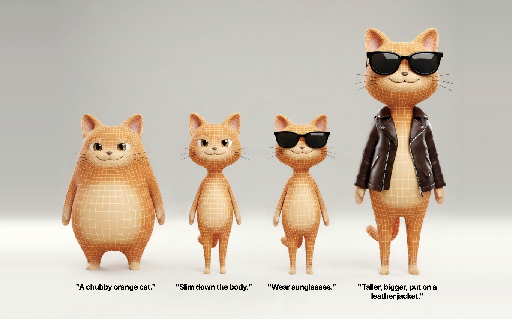

# Miro: Conversational and editable 3D asset generation from text and images

<p align="center">
  
</p>

<div align="center">
  <a href="https://miro.intime3d.com" target="_blank"></a>
  <a href="https://huggingface.co/IntimeAI/Miro" target="_blank"></a>
  <a href="https://github.com/IntimeAI/Miro" target="_blank"></a>
  
  <a href="https://discord.gg/Yf3YydCu" target="_blank"></a>
</div>

## 📖 Overview

Miro is a production-ready 3D generation pipeline featuring multi-turn conversational editing capabilities. Through natural language or image dialogue, users can iteratively refine their 3D models, making progressive adjustments until achieving the desired results.

This repository provides a complete service infrastructure:

- **MiroShape Server**: 3D model generation service based on Miro model
- **MiroImage Server**: Image editing and generation service powered by Qwen-Image-Edit-2511
- **Web Interface**: Interactive Gradio UI with multi-turn conversational editing, or try it directly on our [official website](https://miro.intime3d.com)
- **Client Examples**: Ready-to-use API client implementations

### Key Features

- 💬 **Multi-turn Conversational Editing**: Iteratively refine 3D models through natural language dialogue
- 🔄 **Version History Management**: Track all iterations and revert to any previous version
- 🎨 **Text-to-3D Creation**: Generate 3D models directly from text descriptions
- 🖼️ **Image-to-3D Conversion**: Transform 2D images into high-quality 3D assets
- 🌐 **Production-Ready API**: RESTful API design for easy integration
- 🖥️ **Interactive Web Interface**: User-friendly Gradio UI for seamless iteration

## 📦 Model Information

### Miro Model

- **Fine-tuned Model**: [IntimeAI/Miro](https://huggingface.co/IntimeAI/Miro)
- **Base Model**: [tencent/Hunyuan3D-2.1](https://huggingface.co/tencent/Hunyuan3D-2.1)
- **License**: Apache License 2.0
- **Task**: Image-to-3D Generation
- **Languages**: Chinese, English

The Miro model is fine-tuned from Tencent Hunyuan3D-2.1 on a private dataset, optimized for generating high-quality and easy-to-edit 3D models suitable for production use.

## 🚀 Quick Start

The fastest way to get started is by visiting our [official website](https://miro.intime3d.com).

For local deployment, follow the instructions below:

### System Requirements

- **Operating System**: Linux
- **Python Version**: 3.12
- **GPU**: CUDA-compatible GPU recommended for optimal performance

### Setup Instructions

1. **Clone the repository with submodules**:
   ```bash
   git clone --recurse-submodules https://github.com/IntimeAI/Miro.git
   cd Miro
   ```

2. **Create and activate conda environment**:
   ```bash
   conda create -n miro python=3.12
   conda activate miro
   ```

3. **Install dependencies**:
   ```bash
   pip install -r requirements.txt
   pip install -e ./thirdparty/vllm-omni
   ```
### Gradio Web Interface (Recommended for Interactive Use)

The Gradio interface provides the most user-friendly experience with multi-turn conversational editing capabilities.

**Prerequisites**: Both MiroImage and MiroShape servers must be running before launching Gradio.

**Step 1**: Start both backend servers:
```bash
./servers/start_servers.sh start --miroimage-gpu 0 --miroshape-gpu 0
```

**Step 2**: Launch the Gradio interface:
```bash
python gradio_app.py
```

Then open your browser and navigate to the provided URL (typically `http://localhost:7860`).

**Features**:
- Multi-turn conversational editing with natural language
- Upload images or describe your 3D model in text
- Real-time 3D model visualization
- Version history management
- Download generated models in GLB format

### Advanced Usage

For detailed advanced usage, please refer to the [Document](servers/README.md).

## 📝 Citation

If you use the Miro model or this pipeline in your research or projects, please cite:

```bibtex
@misc{miro2026,
  title={Miro: Conversational and editable 3D asset generation from text and images},
  author={IntimeAI},
  year={2026},
  publisher={github},
  url={https://github.com/IntimeAI/Miro},
}
```

Please also cite the base model Tencent Hunyuan3D:

```bibtex
@misc{hunyuan3d2025hunyuan3d,
    title={Hunyuan3D 2.1: From Images to High-Fidelity 3D Assets with Production-Ready PBR Material},
    author={Team Hunyuan3D and Shuhui Yang and Mingxin Yang and Yifei Feng and Xin Huang and Sheng Zhang and Zebin He and Di Luo and Haolin Liu and Yunfei Zhao and Qingxiang Lin and Zeqiang Lai and Xianghui Yang and Huiwen Shi and Zibo Zhao and Bowen Zhang and Hongyu Yan and Lifu Wang and Sicong Liu and Jihong Zhang and Meng Chen and Liang Dong and Yiwen Jia and Yulin Cai and Jiaao Yu and Yixuan Tang and Dongyuan Guo and Junlin Yu and Hao Zhang and Zheng Ye and Peng He and Runzhou Wu and Shida Wei and Chao Zhang and Yonghao Tan and Yifu Sun and Lin Niu and Shirui Huang and Bojian Zheng and Shu Liu and Shilin Chen and Xiang Yuan and Xiaofeng Yang and Kai Liu and Jianchen Zhu and Peng Chen and Tian Liu and Di Wang and Yuhong Liu and Linus and Jie Jiang and Jingwei Huang and Chunchao Guo},
    year={2025},
    eprint={2506.15442},
    archivePrefix={arXiv},
    primaryClass={cs.CV}
}

@misc{hunyuan3d22025tencent,
    title={Hunyuan3D 2.0: Scaling Diffusion Models for High Resolution Textured 3D Assets Generation},
    author={Tencent Hunyuan3D Team},
    year={2025},
    eprint={2501.12202},
    archivePrefix={arXiv},
    primaryClass={cs.CV}
}

@misc{yang2024tencent,
    title={Tencent Hunyuan3D-1.0: A Unified Framework for Text-to-3D and Image-to-3D Generation},
    author={Tencent Hunyuan3D Team},
    year={2024},
    eprint={2411.02293},
    archivePrefix={arXiv},
    primaryClass={cs.CV}
}
```

## 📄 License

This project is released under the [Apache License 2.0](LICENSE).

## 🙏 Acknowledgments

- **Tencent Hunyuan3D Team**: For providing the excellent base model [Hunyuan3D-2.1](https://huggingface.co/tencent/Hunyuan3D-2.1)
- **Qwen Team**: For the powerful [Qwen-Image-Edit-2511](https://huggingface.co/Qwen/Qwen-Image-Edit-2511) model
- **vLLM-Omni**: For the efficient multimodal inference framework
